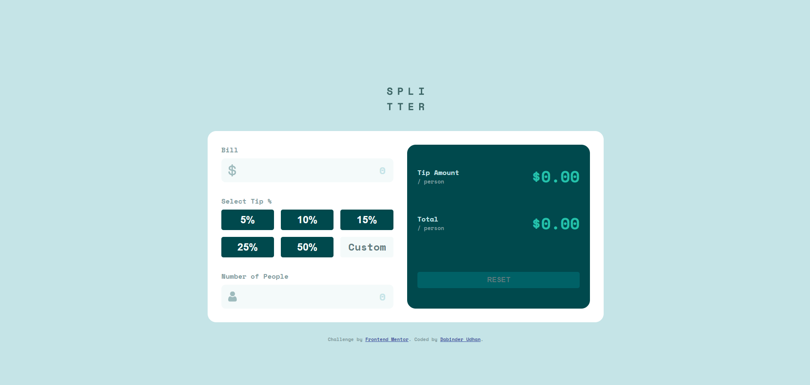

# Frontend Mentor - Tip calculator app solution

This is a solution to the [Tip calculator app challenge on Frontend Mentor](https://www.frontendmentor.io/challenges/tip-calculator-app-ugJNGbJUX). Frontend Mentor challenges help you improve your coding skills by building realistic projects.

## Table of contents

- [Overview](#overview)
  - [The challenge](#the-challenge)
  - [Screenshot](#screenshot)
  - [Links](#links)
- [My process](#my-process)
  - [Built with](#built-with)
  - [What I learned](#what-i-learned)
- [Author](#author)

## Overview

### The challenge

Users should be able to:

- View the optimal layout for the app depending on their device's screen size
- See hover states for all interactive elements on the page
- Calculate the correct tip and total cost of the bill per person

### Screenshot

### Links

- Solution URL: [Github URL](https://github.com/dabinderudhan/tip-calculator-app)
- Live Site URL: [live site URL](https://dabinderudhan.github.io/tip-calculator-app/)

## My process

### Built with

- Semantic HTML5 markup
- CSS custom properties
- Flexbox
- Mobile-first workflow
- SASS
- Vanilla JavaScript

### What I learned

This challenge is good to practice JavaScript. You can learn about how to get and change data from DOM using javascript.

## Author

- Website - [Github profile](https://github.com/dabinderudhan)
- Frontend Mentor - [@dabinderudhan](https://www.frontendmentor.io/profile/dabinderudhan)
- Twitter - [@dabinderudhan](https://twitter.com/dabinderudhan)
